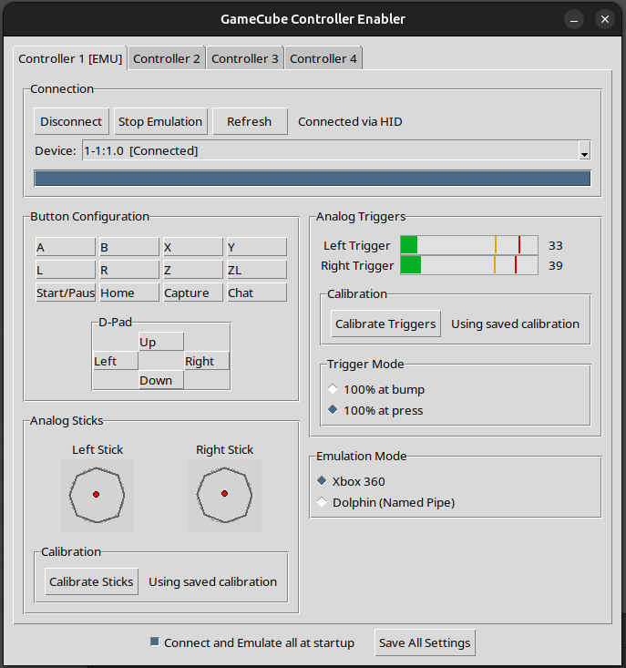

# GameCube Controller Enabler

A cross-platform Python/Tkinter tool that connects Nintendo GameCube controllers via USB and makes them usable on PC through Xbox 360 controller emulation or Dolphin Emulator named pipe input. Supports up to 4 controllers simultaneously with independent calibration profiles.

## Features

- **Multi-controller support** — connect up to 4 GameCube controllers at once, each with its own calibration and emulation settings
- **Xbox 360 emulation** — Windows (ViGEmBus/vgamepad) and Linux (evdev/uinput)
- **Dolphin named pipe emulation** — macOS and Linux; sends input directly to Dolphin Emulator via FIFO pipes with no virtual HID drivers required
- **Analog stick calibration** — interactive wizard that maps your stick's full range and octagon gate
- **Analog trigger calibration** — 6-step wizard with configurable trigger modes (100% at bump or full press)
- **Real-time input visualization** — live display of buttons, sticks, and triggers per controller
- **Per-slot device selection** — assign specific adapters to specific slots, with preferred device persistence
- **Auto-connect** — automatically connect and start emulation on startup
- **Persistent settings** — calibration, device preferences, and emulation mode saved per controller slot

## Requirements

- Python 3.7+
- Platform-specific dependencies (see below)

## Installation

1. Install Python dependencies:
```bash
pip install -r requirements.txt
```

2. Platform-specific setup:

### Windows
- Install the [ViGEmBus driver](https://github.com/nefarius/ViGEmBus) for Xbox 360 emulation

### Linux
- Install system dependencies:
  ```bash
  # Ubuntu/Debian
  sudo apt install libusb-1.0-0-dev python3-tkinter

  # Fedora
  sudo dnf install libusb1-devel python3-tkinter
  ```
- Add your user to the `input` group: `sudo usermod -aG input $USER`
- Install udev rules for controller and uinput access:
  ```bash
  sudo cp platform/linux/99-gc-controller.rules /etc/udev/rules.d/
  sudo udevadm control --reload-rules && sudo udevadm trigger
  ```
- Log out and back in for group changes to take effect

### macOS
- Install libusb: `brew install libusb`
- Xbox 360 emulation is not available on macOS — Dolphin named pipe mode is used instead

## Usage

Install in development mode and run:
```bash
pip install -e .
python -m gc_controller
```

1. Connect your GameCube controller adapter(s) via USB
2. Select a device from the dropdown (or leave on **Auto** to use the first available)
3. Click **Connect** to initialize the controller
4. Choose an emulation mode:
   - **Xbox 360** (Windows/Linux) — creates a virtual Xbox 360 controller visible to Steam and other applications
   - **Dolphin (Named Pipe)** (macOS/Linux) — sends input to Dolphin Emulator via a FIFO pipe
5. Click **Start Emulation**

### Multi-Controller Setup

The application supports up to 4 simultaneous controllers. Each tab in the UI corresponds to a controller slot with independent connection, calibration, and emulation settings.

- Use the **Device** dropdown in each tab to assign a specific adapter
- Preferred device assignments are saved and restored across sessions
- Tab titles reflect status: `Controller 1`, `Controller 1 [ON]` (connected), `Controller 1 [EMU]` (emulating)
- **Auto-connect** (checkbox at the bottom) connects and starts emulation for all available controllers on startup

### Dolphin Named Pipe Setup

When using Dolphin pipe mode, the application creates FIFO pipes that Dolphin reads as a controller input source. Pipes are named `gc_controller_1` through `gc_controller_4` and are placed in:

| Platform | Pipe directory |
|----------|---------------|
| macOS | `~/Library/Application Support/Dolphin/Pipes/` |
| Linux | `~/.local/share/dolphin-emu/Pipes/` (XDG default) |
| Linux (Flatpak) | `~/.var/app/org.DolphinEmu.dolphin-emu/data/dolphin-emu/Pipes/` |
| Linux (legacy) | `~/.dolphin-emu/Pipes/` |

The `$DOLPHIN_EMU_USERPATH` environment variable is also respected if set.

To configure in Dolphin:
1. Open **Controllers** settings
2. Set a GameCube port to **Standard Controller**
3. Click **Configure** and set **Device** to `Pipe/0/gc_controller_1` (or the appropriate number)
4. Map the buttons, or use Dolphin's pipe input auto-configuration

## Building Executables

Platform-specific build scripts are in the `platform/` directory:

- **Windows**: `platform/windows/build.bat`
- **macOS**: `platform/macos/build.sh`
- **Linux**: `platform/linux/build.sh`

Or use the unified build script:
```bash
python build_all.py
```

## Calibration

### Analog Sticks

Click **Calibrate Sticks** and rotate each stick through its full range, hitting all edges of the octagon gate. The wizard records min/max values per axis and octagon gate positions, then normalizes output to the full [-1.0, 1.0] range.

### Analog Triggers

Click **Calibrate Triggers** to run a 6-step wizard that records the resting, bump (click), and fully-pressed positions for each trigger.

Trigger modes:
- **100% at bump**: Full trigger output at the click point — good for digital-style inputs
- **100% at press**: Full trigger output at maximum physical press — preserves full analog range

Calibration is saved per controller slot and persists across sessions.

## Project Structure

```
src/gc_controller/
  __init__.py               Package marker
  __main__.py               Entry point (python -m gc_controller)
  app.py                    Main application orchestrator
  controller_constants.py   Shared constants, button mappings, calibration defaults
  controller_slot.py        Per-controller state bundle (managers + index)
  settings_manager.py       JSON settings load/save with v1→v2 migration
  calibration.py            Stick and trigger calibration logic
  connection_manager.py     USB initialization and HID connection
  emulation_manager.py      Virtual controller lifecycle and input forwarding
  controller_ui.py          Tkinter UI — ttk.Notebook with 4 slot tabs
  input_processor.py        HID read thread and data processing
  virtual_gamepad.py        Cross-platform gamepad abstraction (Xbox 360 / Dolphin pipe)
pyproject.toml              Project metadata and dependencies
gc_controller_enabler.spec  PyInstaller spec file
build_all.py                Unified build script
images/
  controller.png            Application icon
  stick_left.png            Left stick visualization icon
  stick_right.png           Right stick visualization icon
  screenshot.png            Application screenshot
platform/
  linux/
    build.sh                Linux build script
    99-gc-controller.rules  udev rules for USB/uinput access
  macos/
    build.sh                macOS build script
  windows/
    build.bat               Windows build script
    hook-vgamepad.py        PyInstaller hook for vgamepad
```

## Troubleshooting

### Controller Not Detected
- Ensure the GameCube controller adapter is connected
- Verify Vendor ID `0x057e` and Product ID `0x2073` (check `lsusb` on Linux or Device Manager on Windows)
- On Linux, verify udev rules are installed and your user is in the `input` group
- Try the **Refresh** button to re-enumerate devices

### Emulation Not Working
- **Windows**: Install [ViGEmBus](https://github.com/nefarius/ViGEmBus) and `pip install vgamepad`
- **Linux (Xbox 360)**: Install evdev (`pip install evdev`), ensure your user is in the `input` group, and install the udev rules
- **Linux (Dolphin pipe)**: Ensure Dolphin is running and the pipe controller is configured before starting emulation
- **macOS**: Only Dolphin pipe mode is supported — Xbox 360 emulation is not available

### Dolphin Not Seeing the Pipe
- The pipe file must exist before Dolphin opens the controller config window — connect and start emulation in this app first, or launch the app before opening Dolphin's controller settings
- Check that the pipe file exists in the correct directory (see the table above)
- For Flatpak Dolphin, the pipe is placed in the Flatpak data directory automatically

### Permission Errors
- **Windows**: HID access may require administrator privileges
- **Linux**: Add your user to `input` group and install udev rules:
  ```bash
  sudo usermod -aG input $USER
  sudo cp platform/linux/99-gc-controller.rules /etc/udev/rules.d/
  sudo udevadm control --reload-rules
  ```
  Then log out and back in.

## License

This project is licensed under the GNU General Public License v3.0. See [LICENSE_GPLv3](LICENSE_GPLv3) for details.
